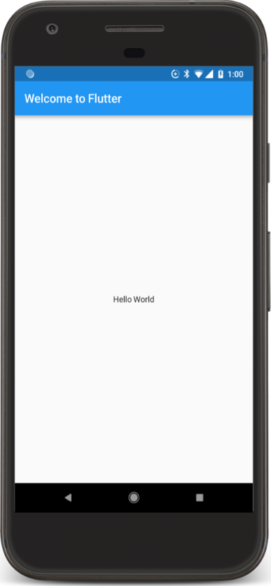
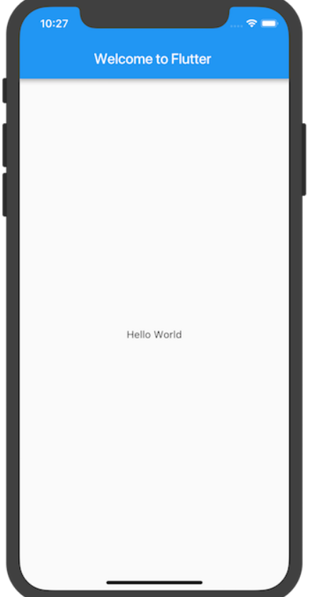

# 01_初识与安装

## Flutter概述
> Flutter是谷歌的移动UI框架，可以快速在iOS和Android上构建高质量的原生用户界面。 Flutter可以与现有的代码一起工作。在全世界，Flutter正在被越来越多的开发者和组织使用，并且Flutter是完全免费、开源的。


## 特点
* 跨平台自绘引擎
* 高性能
* 采用Dart语言开发。


## Flutter框架结构


## 安装软件（Windows）

1. git
1. Dart ([https://www.dartlang.org/tools/sdk#install](https://www.dartlang.org/tools/sdk#install))
1. Flutter ([https://flutter.io/docs/get-started/install](https://flutter.io/docs/get-started/install))
1. Java(开发Android)
1. Android Studio
1. Intellij IDEA(可选)

## 配置环境变量(Path)

* %JAVA_HOME%\bin
* %DART_HOME%\bin
* %ANDROID_HOME%\tools
* %FLUTTER_HOME%\bin

## IDE 插件

* Flutter

## Hello Word
### 创建步骤
1. 创建一个简单的、基于模板的 Flutter 工程，按照指南中所描述的步骤，然后将项目命名为 startup_namer（而不是 myapp），接下来你将会修改这个工程来完成最终的 App。
2. 删除 lib/main.dart 中的所有代码，然后替换为下面的代码，它将在屏幕的中心显示"Hello World"。
```dart
import 'package:flutter/material.dart';

void main() => runApp(new MyApp());

class MyApp extends StatelessWidget {
  @override
  Widget build(BuildContext context) {
    return new MaterialApp(
      title: 'Welcome to Flutter',
      home: new Scaffold(
        appBar: new AppBar(
          title: const Text('Welcome to Flutter'),
        ),
        body: const Center(
          child: const Text('Hello World'),
        ),
      ),
    );
  }
}
```
3. 运行你的工程项目。
  
 

### 观察分析
- 本示例创建了一个具有 Material Design 风格的应用，Material 是一种移动端和网页端通用的视觉设计语言，Flutter 提供了丰富的 Material 风格的 widgets。
- 主函数（main）使用了 (=>) 符号，这是 Dart 中单行函数或方法的简写。
- 该应用程序继承了 StatelessWidget，这将会使应用本身也成为一个 widget。在 Flutter 中，大多数东西都是 widget，包括对齐 (alignment)、填充 (padding) 和布局 (layout)。
- Scaffold 是 Material library 中提供的一个 widget，它提供了默认的导航栏、标题和包含主屏幕 widget 树的 body 属性。widget 树可以很复杂。
- 一个 widget 的主要工作是提供一个 build() 方法来描述如何根据其他较低级别的 widgets 来显示自己。
- 本示例中的 body 的 widget 树中包含了一个 Center widget，Center widget 又包含一个 Text 子 widget，Center widget 可以将其子 widget 树对其到屏幕中心。