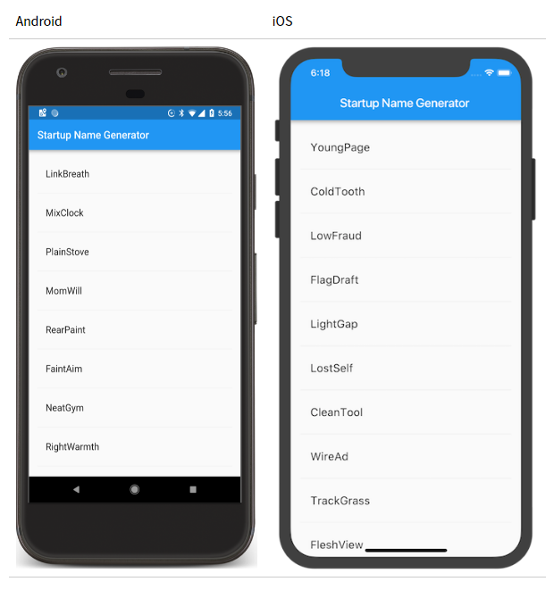
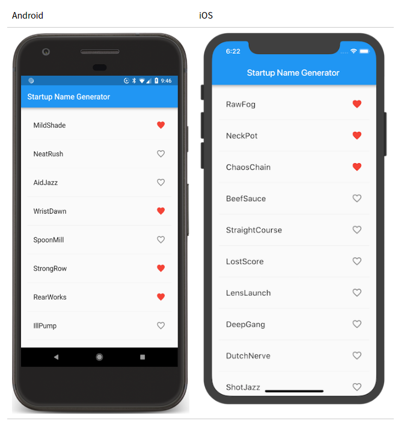
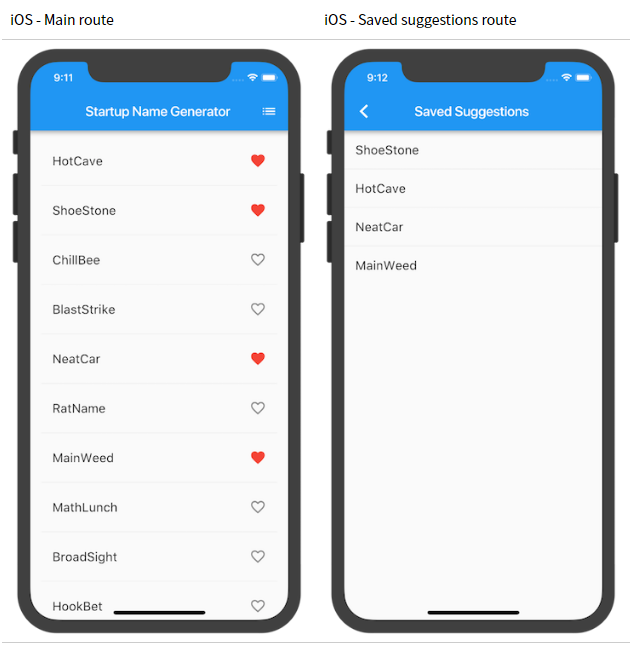

## 使用 package
在这一步中，你将开始使用一个名为 english_words 的开源软件包，其中包含数千个最常用的英文单词以及一些实用功能。

你可以 在 [pub.dartlang.org](https://pub.dartlang.org/flutter/) 上找到 english_words 软件包以及其他许多开源软件包。

1. pubspec 文件管理 Flutter 应用程序的 assets（资源，如图片、package等）。 在pubspec.yaml 中，将 english_words（3.1.0或更高版本）添加到依赖项列表，如下面高亮显示的行：
```dart
dependencies:
  flutter:
    sdk: flutter

  cupertino_icons: ^0.1.0
  english_words: ^3.1.0   # 新增了这一行
```
2. 在Android Studio 的编辑器视图中查看 pubspec 时，单击右上角的 `Packages get`，这会将依赖包安装到您的项目。您可以在控制台中看到以下内容：

```shell
flutter packages get
Running "flutter packages get" in startup_namer...
Process finished with exit code 0
```
3. 在 lib/main.dart 中引入，如下所示：
```dart
import 'package:flutter/material.dart';
import 'package:english_words/english_words.dart';  // 新增了这一行
```
在您输入时，Android Studio会为您提供有关库导入的建议。然后它将呈现灰色的导入字符串，让您知道导入的库截至目前尚未被使用。

接下来，我们使用 English words 包生成文本来替换字符串"Hello World"：

我们需要进行如下更改：
```dart
import 'package:flutter/material.dart';
import 'package:english_words/english_words.dart';

void main() => runApp(new MyApp());

class MyApp extends StatelessWidget {
  @override
  Widget build(BuildContext context) {
    final wordPair = new WordPair.random(); // 新增了这一行
    return new MaterialApp(
      title: 'Welcome to Flutter',
      home: new Scaffold(
        appBar: new AppBar(
          title: new Text('Welcome to Flutter'),
        ),
        body: new Center(    // 这里把之前的 "const" 换成了 "new".
          //child: const Text('Hello World'),   // 我们不用这样的方式生成文字了
          child: new Text(wordPair.asPascalCase),  // 这是新的文字生成方式
        ),
      ),
    );
  }
}
```
> 提示：「大驼峰式命名法」也称为 upper camel case 或 Pascal case，表示字符串中的每个单词（包括第一个单词）都以大写字母开头。所以，uppercamelcase 会变成 UpperCamelCase。

4. 如果你没有把 Center 前面的修饰词从 const 改成 new 的话，系统就会报错，因为这个时候它的子对象已经不是常量，那就不能再用 const 了，所以这里 Center 和 Text 都需要使用 new 创建新的实例。

## 添加一个 Stateful widget

Stateless widgets 是不可变的，这意味着它们的属性不能改变——所有的值都是 final。

Stateful widgets 持有的状态可能在 widget 生命周期中发生变化，实现一个 stateful widget 至少需要两个类：1）一个 StatefulWidget 类；2）一个 State 类，StatefulWidget 类本身是不变的，但是 State 类在 widget 生命周期中始终存在。

在这一步，你将添加一个 stateful widget（有状态的控件）—— RandomWords，它会创建自己的状态类 —— RandomWordsState，然后你需要将 RandomWords 内嵌到已有的无状态的 MyApp widget。

1. 创建一个最简的 state 类，这个类可以在任意地方创建而不一定非要在 MyApp 里，我们的示例代码是放在 MyApp 类的最下面了：
```dart
class RandomWordsState extends State<RandomWords> {
  // TODO Add build method
}
```
> 注意一下 State<RandomWords> 的声明。这表明我们在使用专门用于 RandomWords 的 State 泛型类。应用的大部分逻辑和状态都在这里 —— 它会维护 RandomWords 控件的状态。这个类会保存代码生成的单词对，这个单词对列表会随着用户滑动而无限增长，另外还会保存用户喜爱的单词对（第二部分），也即当用户点击爱心图标的时候会从喜爱的列表中添加或者移除当前单词对。

RandomWordsState 继承自 RandomWords，我们接下来会创建这个类。

2. 添加有状态的 RandomWords widget 到 main.dart，RandomWords widget 除了创建 State 类之外几乎没有其他任何东西：
```dart
class RandomWords extends StatefulWidget {
  @override
  RandomWordsState createState() => new RandomWordsState();
}
```
在添加状态类后，IDE 会提示该类缺少 build 方法。接下来，您将添加一个基本的 build 方法，该方法通过将生成单词对的代码从 MyApp 移动到 RandomWordsState 来生成单词对。

3. 将 build 方法添加到 RandomWordState 中，如下所示：
```dart
class RandomWordsState extends State<RandomWords> {
  @override                                  // 新增代码片段 - 开始 ... 
  Widget build(BuildContext context) {
    final WordPair wordPair = new WordPair.random();
    return new Text(wordPair.asPascalCase);
  }                                          // ... 新增的代码片段 - 结束
}
```
4. 如下所示，删除 MyApp 里生成文字的代码：

```dart
class MyApp extends StatelessWidget {
  @override
  Widget build(BuildContext context) {
    final WordPair wordPair = new WordPair.random();  // 删掉本行
    return new MaterialApp(
      title: 'Welcome to Flutter',
      home: new Scaffold(
        appBar: new AppBar(
          title: new Text('Welcome to Flutter'),
        ),
        body: new Center(
          //child: new Text(wordPair.asPascalCase), // 修改本行内容 
          child: new RandomWords(),                 // 修改成本行代码
        ),
      ),
    );
  }
}
```
5. 热重载（Hot reload）当前的工程，应用应该像之前一样运行，每次热重载或保存应用程序时都会显示一个单词对。

> 提示: 如果您尝试热重载，则可能会看到一条警告，考虑重新启动当前应用：
>  ```shell
>  Reloading...
>  Not all changed program elements ran during view reassembly; consider restarting.
>    ```
>    因为重启应用之后就可以生效，故这可能是误报。

## 创建一个无限滚动的 ListView
在这一步中，您将扩展（继承）RandomWordsState 类，以生成并显示单词对列表。 当用户滚动时，ListView 中显示的列表将无限增长。 ListView 的 builder 工厂构造函数允许您按需建立一个懒加载的列表视图。

1. 向 RandomWordsState 类中添加一个 _suggestions 列表以保存建议的单词对，同时，添加一个 biggerFont 变量来增大字体大小 Also, add a _biggerFont variable for making the font size larger.

> 提示：在 Dart 语言中使用下划线前缀标识符，会强制其变成私有。

```dart
class RandomWordsState extends State<RandomWords> {
  // 添加如下两行
  final List<WordPair> _suggestions = <WordPair>[];
  final TextStyle _biggerFont = const TextStyle(fontSize: 18.0); 
  ...
}
```
接下来，我们将向 RandomWordsState 类添加一个 _buildSuggestions() 函数，此方法构建显示建议单词对的 ListView。

ListView 类提供了一个 builder 属性，itemBuilder 值是一个匿名回调函数， 接受两个参数- BuildContext 和行迭代器 i。迭代器从 0 开始， 每调用一次该函数，i 就会自增 1，对于每个建议的单词对都会执行一次。该模型允许建议的单词对列表在用户滚动时无限增长。

2. 向 RandomWordsState 类添加 _buildSuggestions() 函数，内容如下：
```dart
  Widget _buildSuggestions() {
    return new ListView.builder(
      padding: const EdgeInsets.all(16.0),

      // 对于每个建议的单词对都会调用一次 itemBuilder，
      // 然后将单词对添加到 ListTile 行中
      // 在偶数行，该函数会为单词对添加一个 ListTile row.
      // 在奇数行，该函数会添加一个分割线的 widget，来分隔相邻的词对。
      // 注意，在小屏幕上，分割线看起来可能比较吃力。

      itemBuilder: (BuildContext _context, int i) {
        // 在每一列之前，添加一个1像素高的分隔线widget
        if (i.isOdd) {
          return new Divider();
        }

        // 语法 "i ~/ 2" 表示i除以2，但返回值是整形（向下取整）
        // 比如 i 为：1, 2, 3, 4, 5 时，结果为 0, 1, 1, 2, 2，
        // 这可以计算出 ListView 中减去分隔线后的实际单词对数量
        final int index = i ~/ 2;
        // 如果是建议列表中最后一个单词对
        if (index >= _suggestions.length) {
        // ...接着再生成10个单词对，然后添加到建议列表
          _suggestions.addAll(generateWordPairs().take(10));
        }
        return _buildRow(_suggestions[index]);
      }
    );
  }
```
对于每一个单词对，_buildSuggestions 函数都会调用一次 _buildRow。 这个函数在 ListTile 中显示每个新词对，这使您在下一步中可以生成更漂亮的显示行，详见本 codelab 的第二部分。

3. 在 RandomWordsState 中添加 _buildRow 函数 :
```dart
  Widget _buildRow(WordPair pair) {
    return new ListTile(
      title: new Text(
        pair.asPascalCase,
        style: _biggerFont,
      ),
    );
  }
```
4. 更新 RandomWordsState 的 build 方法以使用 _buildSuggestions()，而不是直接调用单词生成库，代码更改后如下：（使用 Scaffold 类实现基础的 Material Design 布局）
```dart
  @override
  Widget build(BuildContext context) {
    //final wordPair = new WordPair.random(); // 删掉 ... 
    //return new Text(wordPair.asPascalCase); // ... 这两行

    return new Scaffold (                   // 代码从这里... 
      appBar: new AppBar(
        title: new Text('Startup Name Generator'),
      ),
      body: _buildSuggestions(),
    );                                      // ... 添加到这里
  }
```
5. 更新 MyApp 的 build 方法, changing the title, and changing the home to be a RandomWords widget.
```dart
  @override
  Widget build(BuildContext context) {
    return new MaterialApp(
      title: 'Startup Name Generator',
      home: new RandomWords(),
    );
  }
```
6. 重新启动你的项目工程应用，你应该看到一个单词对列表。尽可能地向下滚动，你将继续看到新的单词对。


## 向列表中添加图标
在这部分，我们将为每一行添加一个心形的（收藏）图标，下一步你将能够为这个图标加入点击收藏的功能。

1. 添加一个 _saved Set（集合）到 RandomWordsState，这个集合存储用户喜欢（收藏）的单词对。 在这里，Set 比 List 更合适，因为 Set 中不允许重复的值。
```dart
class RandomWordsState extends State<RandomWords> {
  final List<WordPair> _suggestions = <WordPair>[];
  final Set<WordPair> _saved = new Set<WordPair>();   // 新增本行
  final TextStyle _biggerFont = const TextStyle(fontSize: 18.0);
  ...
}
```
2. 在 _buildRow 方法中添加 alreadySaved 来检查确保单词对还没有添加到收藏夹中。
```dart
Widget _buildRow(WordPair pair) {
  final bool alreadySaved = _saved.contains(pair);  // 新增本行
  ...
}
```
同时在 _buildRow() 中， 添加一个心形 ❤️ 图标到 ListTiles以启用收藏功能。接下来，你就可以给心形 ❤️ 图标添加交互能力了。

3. 向列表添加图标，如下所示：
```dart
Widget _buildRow(WordPair pair) {
  final bool alreadySaved = _saved.contains(pair);
  return new ListTile(
    title: new Text(
      pair.asPascalCase,
      style: _biggerFont,
    ),
    trailing: new Icon(   // 新增代码开始 ...
      alreadySaved ? Icons.favorite : Icons.favorite_border,
      color: alreadySaved ? Colors.red : null,
    ),                    // ... 新增代码结束
  );
}
```
4. 热重载应用，你现在可以在每一行看到心形 ❤️图标️，但它们还没有交互。

## 添加交互
在这部分，我们将为刚刚的心形 ❤️图标增加交互，当用户点击列表中的条目，切换其"收藏"状态，并将该词对添加到或移除出"收藏夹"。

为了做到这个，我们在 _buildRow 中让心形 ❤️图标变得可以点击。如果单词条目已经添加到收藏夹中， 再次点击它将其从收藏夹中删除。当心形 ❤️图标被点击时，函数调用 setState() 通知框架状态已经改变。

1. 增加 onTap 方法，如下所示：
```dart
Widget _buildRow(WordPair pair) {
  final alreadySaved = _saved.contains(pair);
  return new ListTile(
    title: new Text(
      pair.asPascalCase,
      style: _biggerFont,
    ),
    trailing: new Icon(
      alreadySaved ? Icons.favorite : Icons.favorite_border,
      color: alreadySaved ? Colors.red : null,
    ),
    onTap: () {      // 增加如下 9 行代码...
      setState(() {
        if (alreadySaved) {
          _saved.remove(pair);
        } else { 
          _saved.add(pair); 
        } 
      });
    },               // ... 一直到这里
  );
}
```
> 提示: 在 Flutter 的响应式风格的框架中，调用 setState() 会为 State 对象触发 build() 方法，从而导致对 UI 的更新

热重载应用，你就可以点击任何一行测试收藏或取消收藏功能，你的点击同时自带 Material Design 里的水波动画特效。



## 导航到新页面

在这一步中，您将添加一个显示收藏夹内容的新页面（在 Flutter 中称为路由［route］）。您将学习如何在主路由和新路由之间导航（切换页面）。

在 Flutter 中，导航器管理应用程序的路由栈。将路由推入（push）到导航器的栈中，将会显示更新为该路由页面。 从导航器的栈中弹出（pop）路由，将显示返回到前一个路由。

接下来，我们在 RandomWordsState 的 build 方法中为 AppBar 添加一个列表图标。当用户点击列表图标时，包含收藏夹的新路由页面入栈显示。

1. 将该图标及其相应的操作添加到 build 方法中：
```dart
class RandomWordsState extends State<RandomWords> {
  ...
  @override
  Widget build(BuildContext context) {
    return new Scaffold(
      appBar: new AppBar(
        title: new Text('Startup Name Generator'),
        actions: <Widget>[      // 新增代码开始 ...
          new IconButton(icon: const Icon(Icons.list), onPressed: _pushSaved),
        ],                      // ... 代码新增结束
      ),
      body: _buildSuggestions(),
    );
  }
  ...
}
```
> 提示: 某些 widget 属性需要单个 widget（child），而其它一些属性，如 action，需要一组widgets（children），用方括号 [] 表示。

2. 在 RandomWordsState 这个类里添加 _pushSaved() 方法：
```dart
class RandomWordsState extends State<RandomWords> {
  ...
  // 新增代码开始
  void _pushSaved() {
  }
  // 新增代码结束 
}
```
3. 热重载应用，列表图标（）将会出现在导航栏中。现在点击它不会有任何反应，因为 _pushSaved 函数还是空的。

接下来，（当用户点击导航栏中的列表图标时）我们会建立一个路由并将其推入到导航管理器栈中。此操作会切换页面以显示新路由，新页面的内容会在 MaterialPageRoute 的 builder 属性中构建，builder 是一个匿名函数。

4. 添加 Navigator.push 调用，这会使路由入栈（以后路由入栈均指推入到导航管理器的栈）
```dart
void _pushSaved() {
  Navigator.of(context).push(
  );
}
```
接下来，添加 MaterialPageRoute 及其 builder。 现在，添加生成 ListTile 行的代码，ListTile 的 divideTiles() 方法在每个 ListTile 之间添加 1 像素的分割线。 该 divided 变量持有最终的列表项，并通过 toList()方法非常方便的转换成列表显示。

5. 添加如下所示的代码：
```dart
void _pushSaved() {
  Navigator.of(context).push(
    new MaterialPageRoute<void>(   // 新增如下20行代码 ...
      builder: (BuildContext context) {
        final Iterable<ListTile> tiles = _saved.map(
          (WordPair pair) {
            return new ListTile(
              title: new Text(
                pair.asPascalCase,
                style: _biggerFont,
              ),
            );
          },
        );
        final List<Widget> divided = ListTile
          .divideTiles(
            context: context,
            tiles: tiles,
          )
          .toList();
      },
    ),                           // ... 新增代码结束
  );
}
```
builder 返回一个 Scaffold，其中包含名为"Saved Suggestions"的新路由的应用栏。新路由的body 由包含 ListTiles 行的 ListView 组成；每行之间通过一个分隔线分隔。

6. 添加水平分隔符，如下代码所示：
```dart
void _pushSaved() {
  Navigator.of(context).push(
    new MaterialPageRoute<void>(
      builder: (BuildContext context) {
        final Iterable<ListTile> tiles = _saved.map(
          (WordPair pair) {
            return new ListTile(
              title: new Text(
                pair.asPascalCase,
                style: _biggerFont,
              ),
            );
          },
        );
        final List<Widget> divided = ListTile
          .divideTiles(
            context: context,
            tiles: tiles,
          )
              .toList();

        return new Scaffold(         // 新增 6 行代码开始 ...
          appBar: new AppBar(
            title: const Text('Saved Suggestions'),
          ),
          body: new ListView(children: divided),
        );                           // ... 新增代码段结束.
      },
    ),
  );
}
```
7. 热重载应用程序，点击列表项收藏一些项，点击列表图标，在新的 route（路由）页面中显示收藏的内容。Navigator（导航器）会在应用栏中自动添加一个"返回"按钮，无需调用Navigator.pop，点击后退按钮就会返回到主页路由。



## 修改主题
这一部分，我们将会一起修改应用的主题。Flutter 里我们使用 theme 来控制你应用的外观和风格，你可以使用默认主题，该主题取决于物理设备或模拟器，也可以自定义主题以适应您的品牌。

你可以通过配置 ThemeData 类轻松更改应用程序的主题，目前我们的应用程序使用默认主题，下面将更改 primaryColor 颜色为白色。

1. 在 MyApp 这个类里修改颜色：
```dart
class MyApp extends StatelessWidget {
  @override
  Widget build(BuildContext context) {
    return new MaterialApp(
      title: 'Startup Name Generator',
      theme: new ThemeData(          // 新增代码开始... 
        primaryColor: Colors.white,
      ),                             // ... 代码新增结束
      home: new RandomWords(),
    );
  }
}
```
2. 热重载应用。 你会发现，整个背景将会变为白色，包括 app bar（应用栏）。

一个小练习，你可以看一下 [ThemeData](https://docs.flutter.io/flutter/material/ThemeData-class.html) 的文档，添加其他属性来更多改变 UI 样式。Material library 中的 Colors 类提供了许多可以使用的颜色常量， 你可以使用热重载来快速简单地尝试、实验。