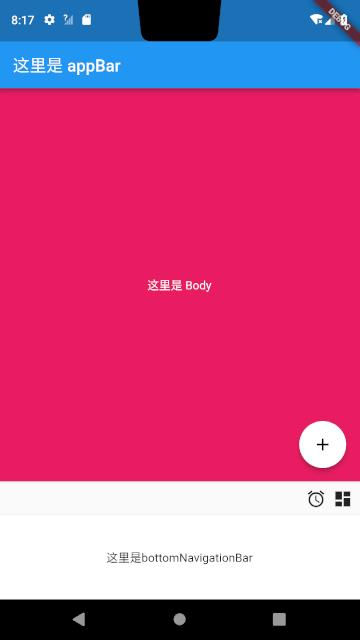

## Material 介绍
### Material Design （质感设计）
是由Google推出的全新设计语言，旨在为手机、平板电脑、台式机和其他平台提供更一致、更广泛的外观和感觉。从2014年开始，Android到衍生的Android Wear、Auto和TV，Material Design贯穿其中，成为勾通不同平台、设备的灵魂，让用户在不同平台上也有连贯的体验。为了维护这种一致，Google不允许第三方修改Android Wear、Auto和TV的界面以及交互

### Flutter Material 
> Flutter 的 Material 组件
通过在应用间和平台间提供一个统一的用户体验组件库，把设计和工程合二为一。秉承着 Google 的前端开发标准，Material Design 系统正在向多端一致体验、像素级完美呈现的方向发展。Material Design 组件（MDC）也同样适用于 Android、iOS 和 Web。

## Scaffold
> Scaffold 实现了基本的 Material 布局。只要是在 Material 中定义了的单个界面显示的布局控件元素，都可以使用 Scaffold 来绘制。

提供展示抽屉(drawers，比如：左边栏)、通知(snack bars) 以及 底部按钮（bottom sheets)。

### 构造函数
```dart
///  * [AppBar], which is a horizontal bar typically shown at the top of an app
///    using the [appBar] property.
///  * [BottomAppBar], which is a horizontal bar typically shown at the bottom
///    of an app using the [bottomNavigationBar] property.
///  * [FloatingActionButton], which is a circular button typically shown in the
///    bottom right corner of the app using the [floatingActionButton] property.
///  * [Drawer], which is a vertical panel that is typically displayed to the
///    left of the body (and often hidden on phones) using the [drawer]
///    property.
///  * [BottomNavigationBar], which is a horizontal array of buttons typically
///    shown along the bottom of the app using the [bottomNavigationBar]
///    property.
///  * [SnackBar], which is a temporary notification typically shown near the
///    bottom of the app using the [ScaffoldState.showSnackBar] method.
///  * [BottomSheet], which is an overlay typically shown near the bottom of the
///    app. A bottom sheet can either be persistent, in which case it is shown
///    using the [ScaffoldState.showBottomSheet] method, or modal, in which case
///    it is shown using the [showModalBottomSheet] function.
///  * [ScaffoldState], which is the state associated with this widget.
///  * <https://material.io/design/layout/responsive-layout-grid.html>
class Scaffold extends StatefulWidget {
  /// Creates a visual scaffold for material design widgets.
  const Scaffold({
    Key key,
    this.appBar,
    this.body,
    this.floatingActionButton,
    this.floatingActionButtonLocation,
    this.floatingActionButtonAnimator,
    this.persistentFooterButtons,
    this.drawer,
    this.endDrawer,
    this.bottomNavigationBar,
    this.bottomSheet,
    this.backgroundColor,
    this.resizeToAvoidBottomPadding = true,
    this.primary = true,
  }) : assert(primary != null), super(key: key);
```
属性	|说明
--|--
appBar	|显示在Scaffold 顶部 相关连接：https://flutterchina.club/catalog/samples/
body	|当前界面所显示的主要内容
floatingActionButton	|默认右下角的悬浮按钮
floatingActionButtonLocation|	悬浮按钮位置，默认右下角
floatingActionButtonAnimator|	悬浮按钮位置位置变换动画
persistentFooterButtons	| 固定在下方显示的按钮。https://material.google.com/components/buttons.html#buttons-persistent-footer-buttons
bottomNavigationBar	| 显示在底部的导航栏按钮栏
bottomSheet	| 底部按钮
drawer | 侧边栏控件
backgroundColor| 背景颜色
resizeToAvoidBottomPadding|控制界面内容 body 是否重新布局来避免底部被覆盖了，比如当键盘显示的时候，重新布局避免被键盘盖住内容。默认值为 true。

### 示例
```dart
return MaterialApp(
  home: Scaffold(
    appBar: AppBar(
      title: Text("这里是 appBar"),
    ),
    body: Container(
      color: Colors.pink,
      alignment: Alignment.center,
      child: Text(
        "这里是 Body",
        style: TextStyle(color: Colors.white),
      ),
    ),
    floatingActionButton: FloatingActionButton(
      // 长按时显示的提示
      tooltip: "你长按了",
      // 前景色
      foregroundColor: Colors.black,
      // 背景色
      backgroundColor: Colors.white,
      // heroTag :hero效果使用的tag
      // 未点击时的阴影值
      elevation: 5.0,
      // 按下时的阴影值
      highlightElevation: 12.0,

      child: Icon(Icons.add),
      onPressed: () {
        print('你点击了我!');
      },
    ),
    bottomNavigationBar: BottomAppBar(
      child: Container(
        height: 100.0,
        alignment: Alignment.center,
        child: Text("这里是bottomNavigationBar"),
      ),
    ),
    persistentFooterButtons: <Widget>[
      Icon(Icons.access_alarms),
      Icon(Icons.dashboard)
    ],
  ),
);
```
