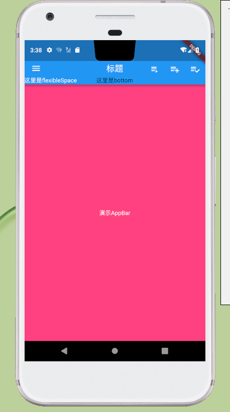

## 介绍
> AppBar 显示在app的顶部。AppBar包含5大部分，如下图：


### 构造函数
```dart
AppBar({
  Key key,
  this.leading,//在标题前面显示的一个控件，在首页通常显示应用的 logo；在其他界面通常显示为返回按钮
  this.automaticallyImplyLeading = true,
  this.title,//Toolbar 中主要内容，通常显示为当前界面的标题文字
  this.actions,//一个 Widget 列表，代表 Toolbar 中所显示的菜单，对于常用的菜单，通常使用 IconButton 来表示；对于不常用的菜单通常使用 PopupMenuButton 来显示为三个点，点击后弹出二级菜单
  this.flexibleSpace,//一个显示在 AppBar 下方的控件，高度和 AppBar 高度一样，可以实现一些特殊的效果，该属性通常在SliverAppBar 中使用
  this.bottom,//一个 AppBarBottomWidget 对象，通常是 TabBar。用来在 Toolbar 标题下面显示一个 Tab 导航栏
  this.elevation = 4.0,//纸墨设计中控件的 z 坐标顺序，默认值为 4，对于可滚动的 SliverAppBar，当 SliverAppBar 和内容同级的时候，该值为 0， 当内容滚动 SliverAppBar 变为 Toolbar 的时候，修改 elevation 的值
  this.backgroundColor,//APP bar 的颜色，默认值为 ThemeData.primaryColor。改值通常和下面的三个属性一起使用
  this.brightness,//App bar 的亮度，有白色和黑色两种主题，默认值为 ThemeData.primaryColorBrightness
  this.iconTheme,//App bar 上图标的颜色、透明度、和尺寸信息。默认值为 ThemeData.primaryIconTheme
  this.textTheme,//App bar 上的文字样式。默认值为 ThemeData.primaryTextTheme
  this.primary = true,
  this.centerTitle,//标题是否居中显示，默认值根据不同的操作系统，显示方式不一样,true居中 false居左
  this.titleSpacing = NavigationToolbar.kMiddleSpacing,
  this.toolbarOpacity = 1.0,
  this.bottomOpacity = 1.0,
})
 
```
 | 属性            | 说明                                     |
 | --------------- | ---------------------------------------- |
 | leading         | 左上角的控件，一般放一个icon，位置如上图 |
 | title           | 标题，位置如上图                         |
 | actions         | 一系列的组件，位置如上图                 |
 | flexibleSpace   | 位置如上图                               |
 | bottom          | 位置如上图                               |
 | elevation       | 阴影Z轴                                  |
 | backgroundColor | 背景颜色                                 |
 | brightness      | 亮度                                     |
 | iconTheme       | 图标样式                                 |
 | textTheme       | 字体样式                                 |
 | centerTitle     | title是否显示在中间                      |

### 示例
```dart
return MaterialApp(
  home: Scaffold(
   appBar: AppBar(
          leading: Icon(Icons.menu),
          title: Text("标题"),
          centerTitle: true,
          actions: <Widget>[
            IconButton(
              icon: Icon(Icons.playlist_play),
              tooltip: "Air it",
              onPressed: (){
                print("你点击了 Air");
              },
            ),
            IconButton(
              icon: Icon(Icons.playlist_add),
              tooltip: 'Restitch it',
              onPressed: (){
                print("你点击了 Restitch");
              },
            ),
            IconButton(
              icon: Icon(Icons.playlist_add_check),
              tooltip: 'Repair  it',
              onPressed: (){
                print("你点击了 Repair");
              },
            ),
          ],
          flexibleSpace: Container(
            color: Colors.blue,
            alignment: Alignment.bottomLeft,
            child: Text("这里是flexibleSpace",style: TextStyle(color: Colors.white),),
          ),
          bottom: PreferredSize(child: Text("这里是bottom"), preferredSize: null),
        ),
  ),
);
```
