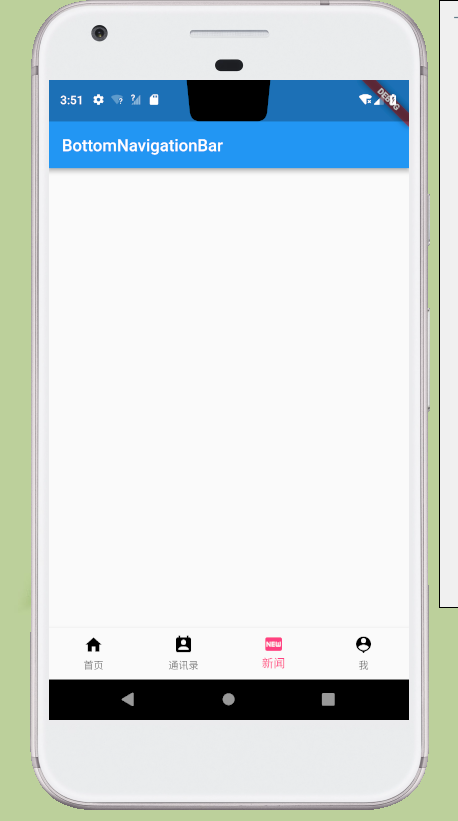

## 介绍
> 底部导航是常见的APP布局方式，实际上我自己常用的app都是底部导航的

##相关属性
### BottomNavigationBar
 | 属性         | 说明                                                                |
 | ------------ | ------------------------------------------------------------------- |
 | items        | BottomNavigationBarItem 列表，包含了导航栏中的按钮                  |
 | currentIndex | 当前所高亮的按钮index                                               |
 | type         | BottomNavigationBarType 中定义的类型，有 fixed 和 shifting 两种类型 |
 | fixedColor   | 如果 type 类型为 fixed，则通过 fixedColor 设置选中 item 的颜色      |
 | iconSize     | BottomNavigationBarItem 中 icon 的大小                              |
### BottomNavigationBarItem 
 | 属性            | 说明                     |
 | --------------- | ------------------------ |
 | icon            | 图标 widget，一般为 Icon |
 | title           | 标题 widget，一般为 Text |
 | backgroundColor | item 的背景颜色          |

### 示例
```dart
import 'package:flutter/material.dart';

class BottomNavigationBarMaterial extends StatefulWidget {
  @override
  State<StatefulWidget> createState() => _BottomNavigationBar();
}

class _BottomNavigationBar extends State<BottomNavigationBarMaterial> {
  int _selectIndex = 0;

  @override
  Widget build(BuildContext context) {
    return MaterialApp(
      home: Scaffold(
        appBar: AppBar(
          title: Text("BottomNavigationBar"),
        ),
        bottomNavigationBar: BottomNavigationBar(
          items: <BottomNavigationBarItem>[
            BottomNavigationBarItem(
              title: Text(
                '首页',
              ),
              icon: Icon(
                Icons.home,
                color: Colors.black,
              ),
              activeIcon: Icon(
                Icons.home,
                color: Colors.pinkAccent,
              ),
            ),
            BottomNavigationBarItem(
              title: Text(
                '通讯录',
              ),
              icon: Icon(
                Icons.perm_contact_calendar,
                color: Colors.black,
              ),
              activeIcon: Icon(
                Icons.perm_contact_calendar,
                color: Colors.pinkAccent,
              ),
            ),
            BottomNavigationBarItem(
              title: Text(
                '新闻',
              ),
              icon: Icon(
                Icons.fiber_new,
                color: Colors.black,
              ),
              activeIcon: Icon(
                Icons.fiber_new,
                color: Colors.pinkAccent,
              ),
            ),
            BottomNavigationBarItem(
              title: Text(
                '我',
              ),
              icon: Icon(
                Icons.person_pin,
                color: Colors.black,
              ),
              activeIcon: Icon(
                Icons.person_pin,
                color: Colors.pinkAccent,
              ),
            ),
          ],
          // icon大小
          iconSize: 24,
          // 默认选中第几个
          currentIndex: _selectIndex,
          // 选中变化回调
          onTap: (index) {
            setState(() {
              _selectIndex = index;
            });
          },
          // type=BottomNavigationBarType.fixed时选中字体的颜色
          fixedColor: Colors.pinkAccent,
          type: BottomNavigationBarType.fixed,
        ),
      ),
    );
  }
}

```
