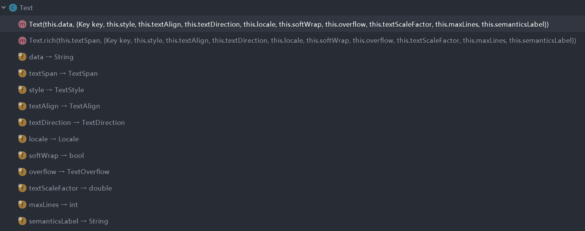

## 1. 介绍
> Text用于显示简单样式文本，它包含一些控制文本显示样式的一些属性。

## 类结构


## 属性
### data
> 显示的文本

### style
> 字体样式

| 属性值          | 意义                                            |
| --------------- | ----------------------------------------------- |
| inherit         | 是否继承                                        |
| color           | 字体颜色                                        |
| fontSize        | 字体大小                                        |
| fontWeight      | 字体厚度，也就是字体粗细                        |
| fontStyle       | normal或者italic                                |
| letterSpacing   | 字母间隙(负值可以让字母更紧凑)                  |
| wordSpacing     | 单词间隙(负值可以让单词更紧凑)                  |
| textBaseLine    | 文本绘制基线(alphabetic/ideographic)            |
| height          | 高度                                            |
| locale          | 区域设置                                        |
| decoration      | 文字装饰(none/underline/overline/lineThrough)   |
| decorationColor | 文字装饰的颜色                                  |
| decorationStyle | 文字装饰的风格(solid/double/dotted/dashed/wavy) |
| fontFamily      | 字体                                            |

### textAlign
> 文本对齐

| TextAlign        | 说明      |
| ---------------- | --------- |
| TextAlign.left   | 左对齐    |
| TextAlign.right  | 右对齐    |
| TextAlign.center | 居中      |
| TextAlign.justfy | 两端对齐  |
| TextAlign.start  | 类似left  |
| TextAlign.end    | 类似right |

### textDiection
> 文字方向
- TextDirection.ltr 左
- TextDirection.rtl 右
  
### softWrap
> 是否自动换行,若为false，文字将不考虑容器大小，单行显示，超出屏幕部分将默认截断处理

### overflow
> 文字溢出的显示方式
- TextOverflow.clip 默认裁剪
- TextOverflow.fade 逐渐隐藏
- TextOverflow.ellipsis 省略号

### textScaleFactor
> 显示倍率，相当于放大多少倍

### maxLines
> 最大显示行数

### textSpan
> 对一个Text内容的不同部分按照不同的样式显示，这时就可以使用TextSpan。

#### 构造函数
```dart
const TextSpan({
  TextStyle style, 
  Sting text,
  List<TextSpan> children,
  GestureRecognizer recognizer,
});
```

#### 示例
```dart
Text.rich(TextSpan(
    children: [
     TextSpan(
       text: "Home: "
     ),
     TextSpan(
       text: "https://flutterchina.club",
       style: TextStyle(
         color: Colors.blue
       ),  
       recognizer: _tapRecognizer
     ),
    ]
))
```


