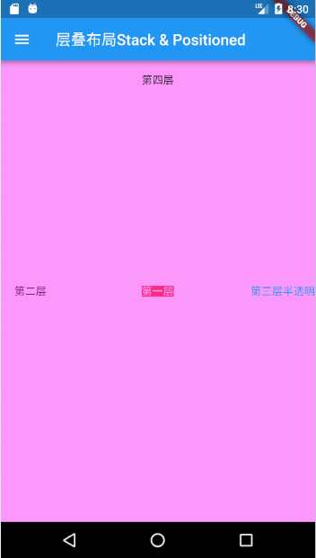

## 层叠布局
层叠布局和Web中的绝对定位、Android中的Frame布局是相似的，子widget可以根据到父容器四个角的位置来确定本身的位置。绝对定位允许子widget堆叠（按照代码中声明的顺序）。Flutter中使用Stack和Positioned来实现绝对定位，Stack允许子widget堆叠，而Positioned可以给子widget定位（根据Stack的四个角）。
## Stack
```dart
Stack({
  this.alignment = AlignmentDirectional.topStart,
  this.textDirection,
  this.fit = StackFit.loose,
  this.overflow = Overflow.clip,
  List<Widget> children = const <Widget>[],
})
```
- alignment：此参数决定如何去对齐没有定位（没有使用Positioned）或部分定位的子widget。所谓部分定位，在这里特指没有在某一个轴上定位：left、right为横轴，top、bottom为纵轴，只要包含某个轴上的一个定位属性就算在该轴上有定位。
- textDirection：和Row、Wrap的textDirection功能一样，都用于决定alignment对齐的参考系即：textDirection的值为TextDirection.ltr，则alignment的start代表左，end代表右；textDirection的值为TextDirection.rtl，则alignment的start代表右，end代表左。
- fit：此参数用于决定没有定位的子widget如何去适应Stack的大小。StackFit.loose表示使用子widget的大小，StackFit.expand表示扩伸到Stack的大小。
- overflow：此属性决定如何显示超出Stack显示空间的子widget，值为Overflow.clip时，超出部分会被剪裁（隐藏），值为Overflow.visible 时则不会。

## Positioned
```dart
const Positioned({
  Key key,
  this.left, 
  this.top,
  this.right,
  this.bottom,
  this.width,
  this.height,
  @required Widget child,
})
```
left、top 、right、 bottom分别代表离Stack左、上、右、底四边的距离。width和height用于指定定位元素的宽度和高度，注意，此处的width、height 和其它地方的意义稍微有点区别，此处用于配合left、top 、right、 bottom来定位widget，举个例子，在水平方向时，你只能指定left、right、width三个属性中的两个，如指定left和width后，right会自动算出(left+width)，如果同时指定三个属性则会报错，垂直方向同理。

示例
```dart
//通过ConstrainedBox来确保Stack占满屏幕
ConstrainedBox(
    constraints: BoxConstraints.expand(),
    child: Stack(
    alignment: Alignment.center, //指定未定位或部分定位widget的对齐方式
    children: <Widget>[
        Container(
        child: Text("第一层", style: TextStyle(color: Colors.white)),
        color: Colors.red,
        ),
        Positioned(
        left: 18.0,
        child: Text("第二层"),
        ),
        Container(
        alignment: Alignment.centerRight,
        child: Text("第三层半透明", style: TextStyle(color: Colors.blue)),
        color: Color.fromARGB(100, 255, 0, 255),
        ),
        Positioned(
        top: 18.0,
        child: Text("第四层"),
        )
    ],
    ),
);
```


