## 用例图（Use Case)
主要用来描述“用户、需求、系统功能单元”之间的关系。它展示了一个外部用户能够观察到的系统功能模型图。

### 主要元素
#### 1. 参与者(Actor)
> 表示与您的应用程序或系统进行交互的用户、组织或外部系统。用一个小人表示。
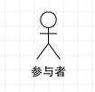

#### 2. 用例(Use Case)
> 用例就是外部可见的系统功能，对系统提供的服务进行描述。用椭圆表示。
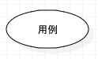

#### 3. 子系统(Subsystem)
> 用来展示系统的一部分功能，这部分功能联系紧密。
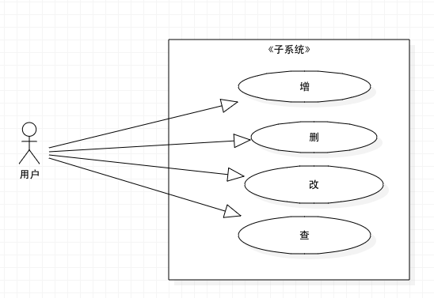

#### 4. 关系
> 用例图中涉及的关系有：关联、泛化、包含、扩展。

关系类型|说明|箭头指向
--|--|--
关联|参与者与用例的关系|消息接收方
泛化|参与者之间或者用例之间的关系|父用例
包括| 用例之间的关系|分解出来的功能用例
扩展|用例之间的关系|基础用例
`依赖-VS2010的用例模型图中，添加了依赖关系`
##### 关联(Association)
表示参与者与用例之间的通信，任何一方都可发送或接受消息。
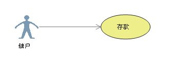Â
##### 泛化(Inheritance)
就是通常理解的继承关系，子用例和父用例相似，但表现出更特别的行为；子用例将继承父用例的所有结构、行为和关系。子用例可以使用父用例的一段行为，也可以重载它。父用例通常是抽象的。

##### 包含(Include)
包含关系用来把一个较复杂用例所表示的功能分解成较小的步骤。
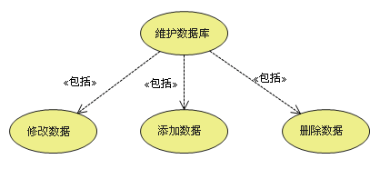
##### 扩展(Extend)
扩展关系是指用例功能的延伸，相当于为基础用例提供一个附加功能。
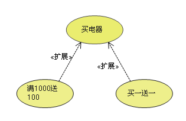
##### 依赖(Dependency)
以上4种关系，是UML定义的标准关系。但VS2010的用例模型图中，添加了依赖关系，用带箭头的虚线表示，表示源用例依赖于目标用例。
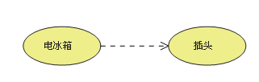

#### 5. 项目(Artifact)
`VS2010中引入了“项目”这样一个元素`
用例图虽然是用来帮助人们形象地理解功能需求，但却没多少人能够通看懂它。很多时候跟用户交流甚至用Excel都比用例图强，以便让开发人员能够在用例图中链接一个普通文档。
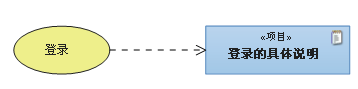

#### 6. 注释(Comment)
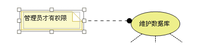

### 包含(include)、扩展(extend)、泛化(Inheritance) 的区别
- 条件性：泛化中的子用例和include中的被包含的用例会无条件发生，而extend中的延伸用例的发生是有条件的；
- 直接性：泛化中的子用例和extend中的延伸用例为参与者提供直接服务，而include中被包含的用例为参与者提供间接服务。
- 对extend而言，延伸用例并不包含基础用例的内容，基础用例也不包含延伸用例的内容。
- 对Inheritance而言，子用例包含基础用例的所有内容及其和其他用例或参与者之间的关系；

### 如何画Use Case 用例视图
本人使用的工具是 `Start UML`
#### 1. 新建工程
    [file]->[New]
#### 2. 新建Use Case Diagram
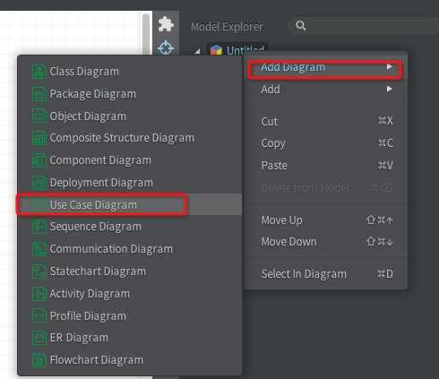
#### 3. 从左侧Toolbox中选择相关的对象，放到中部编辑区
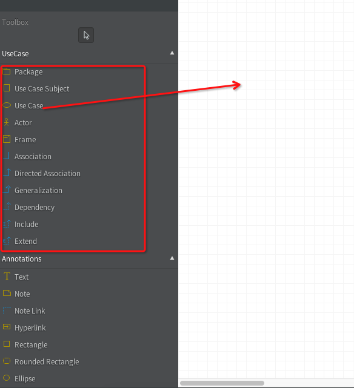

可以参考灵动生活的[设计阶段如何画用例视图（Use-Case View）](http://www.cnblogs.com/ywqu/archive/2009/12/03/1616232.html#_Toc247614719)

### 示例：图书管理系统的UC
#### 需求描述
该系统是一套图书管理系统（主要是模仿学校当前的图书系统设置的），主要的服务人员为读者、图书管理员和系统管理员。
- 读者：
  1. 办理图书借阅卡
  2. 查询图书  （可分为查询已借图书和查询可借图书，这个关系可以理解成泛化）
  3. 借阅图书    
  4. 预约图书    
  5. 还书
  6. 续借图书
- 图书管理员：
  1. 借书
  2. 还书
  3. 管理图书信息，包括：
    - 统计缺失的书
    - 订购新书
    - 入库新书（增加图书记录）
    - 更新/删除图书记录
  4. 收罚金，撤销违规记录
- 系统管理员：系统维护
  - 日志维护
  - 权限维护
  - 用户管理
  - 数据库维护

#### 实际作图
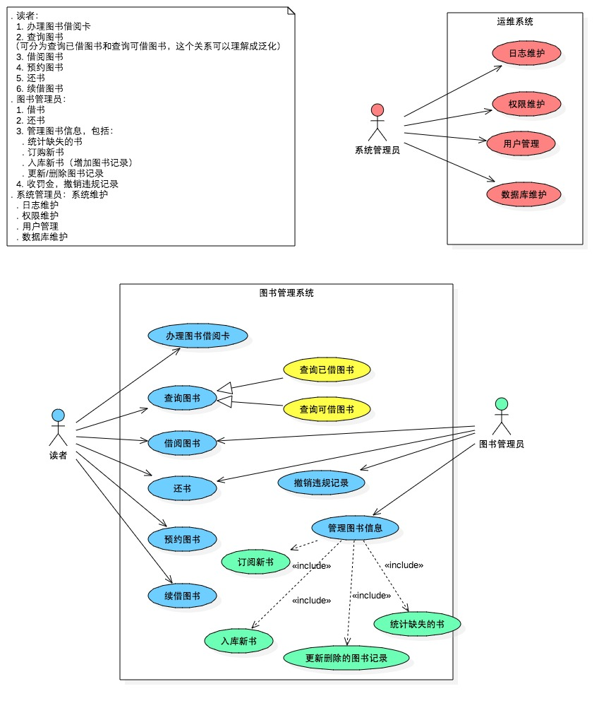
