## 静态图
包括类图、对象图、包图
### 类图（Class diagram）
#### 简介
类是对象的集合，展示了对象的结构以及与系统的交互行为。类主要有属性（Attribute）和方法（Method）构成,属性代表对象的状态，如果属性被保存到数据库，此称之为“持久化”；方法代表对象的操作行为，类具有继承关系，可以继承于父类，也可以与其他的Class进行交互。
类图展示了系统的逻辑结构，类和接口的关系。

#### 类的构成
类主要有属性和方法构成。比如商品属性有：名称、价格、高度、宽度等；商品的方法有：计算税率，获得商品的评价等等。
- `+`表示public
- `#`表示protected
- `—`表示private
- `~`表示package

#### 类图的元素
>在类图中一共包含了以下几种模型元素，分别是：类（Class）、接口（Interface）、依赖（Dependency）关系、泛化（Generalization）关系、关联（Association）关系、聚合关系（Aggregation）、组合关系（Composition）和实现（Realization）关系。

1. 类（Class)
>在面向对象（OO) 编程中，类是对现实世界中一组具有相同特征的物体的抽象。

2. 接口（Interface）
>接口是一种特殊的类，具有类的结构但不可被实例化，只可以被实现（继承）。在UML中，接口使用一个带有名称的小圆圈来进行表示。

3. 关联(Association)
> 两个相对独立的对象，当一个对象的实例与另外一个对象的特定实例存在固定关系时，这两个对象之间就存在关联关系。

  1. 单向关联
>A1->A2: 表示A1认识A2，A1知道A2的存在，A1可以调用A2中的方法和属性 
场景：订单和商品，订单中包括商品，但是商品并不了解订单的存在。 
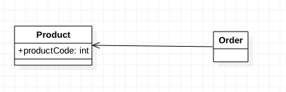

  2. 双向关联
>B1-B2: 表示B1认识B2，B1知道B2的存在，B1可以调用B2中的方法和属性；同样B2也知道B1的存在，B2也可以调用B1的方法和属性。 
场景：订单和客户，订单属于客户，客户拥有一些特定的订单 
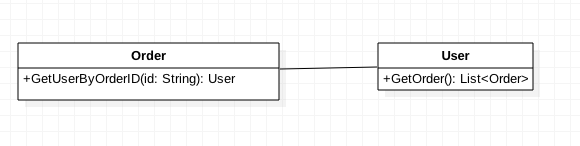

  3. 自身关联
>同一个类对象之间的关联 
场景：组织结构的层次关系 
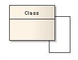

  4. 多维关联(N-ary Association)
>多个对象之间存在关联 
场景：公司雇用员工，同时公司需要支付工资给员工 
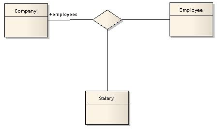

  5. 泛化(Generalization)
>类与类的继承关系，类与接口的实现关系。 
场景：父与子、动物与人、植物与树、系统使用者与B2C会员和B2E会员的关系 

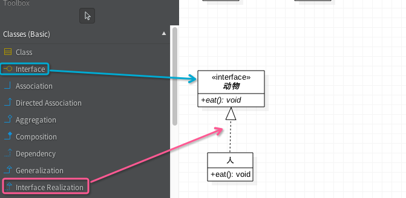

  6. 依赖(Dependency)
>类A要完成某个功能必须引用类B，则A与B存在依赖关系，依赖关系是弱的关联关系。C#不建议双相依赖，也就是相互引用 
场景：本来人与电脑没有关系的，但由于偶然的机会，人需要用电脑写程序，这时候人就依赖于电脑。 
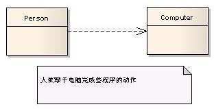

  7. 聚合(Aggregation)
>当对象A被加入到对象B中，成为对象B的组成部分时，对象B和对象A之间为聚合关系。聚合是关联关系的一种，是较强的关联关系，强调的是整体与部分之间的关系。 
场景：商品和他的规格、样式就是聚合关系。 
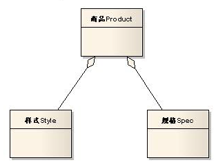

  8. 组合（Composite）
>对象A包含对象B，对象B离开对象A没有实际意义。是一种更强的关联关系。人包含手，手离开人的躯体就失去了它应有的作用。 
场景： Window窗体由滑动条slider、头部Header 和工作区Panel组合而成。 
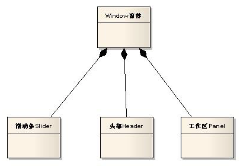

  9. 实现（Realization）
  >一般来讲实现关系是针对类与接口之间的关系而言的。在UML类图中，实现关系用空心三角形+虚线来表示。

#### StartUML实现画图
startUML连线含义 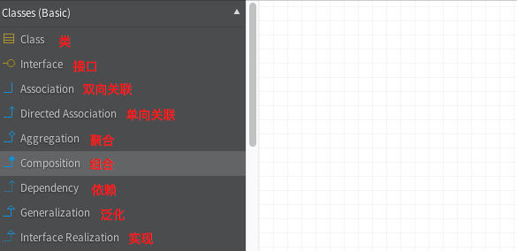 
作图参考[使用StarUML创建类图](http://www.flyne.org/article/379)

#### 练习
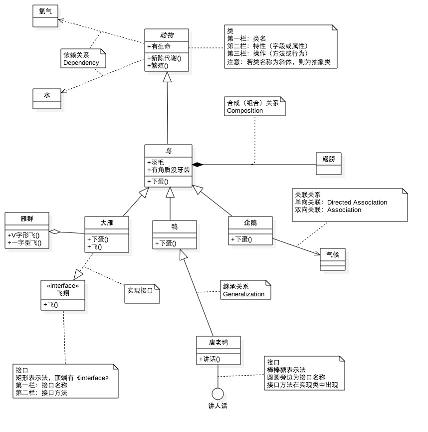

### 对象图（Object Diagram）
#### 简介
>对象图(Object Diagram)描述的是参与交互的各个对象在交互过程中某一时刻的状态。对象图可以被看作是类图在某一时刻的实例。

在UML中，对象图使用的是与类图相同的符号和关系，因为对象就是类的实例。
#### 构成
>对象图中包含对象（Object）和链（Link），对象是类的特定实例，链是类之间关系的实例。和类图一样，对象图对系统的静态设计或静态进程视图建模，对象图更注重现实或原型实例，这种视图主要支持系统的功能需求，对象图描述了静态的数据结构。

#### 用途
- 捕获示例和连接
- 在分析和设计阶段创建
- 捕获交互的静态部分
- 举例说明数据/对象结构
- 详细描述瞬间图
- 工分析人士、设计人员和代码实现人员开发和使用

#### 类图和对象图的区别
类图|对象图
--|--
类具有3个分栏，名称、特性、行为|对象只有两个分栏：名称、特性
名称栏只有类名|名称形式为“对象名：类名”，匿名对象的名称形式":类名"
特征栏包含所有特性|特征栏之定义了特征的当前值，以便用于测试用例或者例子中
类中列出了操作|不包含操作
使用关联连接，关联使用名称、角色、多重性以及约束特征定义。类带白哦的是对象分类，所以必须说明可以参与关联的对象数目|对象使用链接连、链拥有名称、角色，但是没有多重性。对象代表的是单独的实体，所有的链都是一对一，因此不涉及多重性。

#### 样例
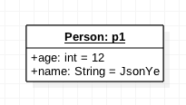

### 包图（Package Diagram）
#### 简介
>包图（Package Diagram）由包和包之间的关系构成，对维护和控制系统总体结构很重要。系统建模中，有大量的类、接口、组件、节点和图，有必要将这些元素进行分组，把语义相近并倾向一起变化的元素组织起来加入同一包，这样方便理解和处理整个模型。设计良好的包是高内聚、低耦合的，并且对其内容的访问具有严密的控制。

#### 包名
>每个包都必须有一个区别于其他包的名字。模型包的名字是一个字符串，可以分为简单名和路径名。

- 简单名：指包仅含一个简单的名称。
- 路径名：指以包位于的外围包的名字作为前缀。

#### 拥有的元素
- 包可以拥有类、接口、组件、节点、协作、用例图，甚至还可以包含其他的包
- 包构成一个命名空间，这意味着一个模型包内各个包类建模元素不可以具有相同的名字，不同
- 如果包被撤销，其中的元素也要被撤销。

#### 包的可见性
>包并不是独立存在的，包内的元素必然会和外部的类存在关系。而好的软件模型中的各个包应该做到高内聚、低耦合，为了做到这一点，就需要对包内的元素加以控制，使得某些元素能被外界访问，其他元素对外界不可见。这就是包内元素的可见性控制。

包的可见性分为3种：
1. 公有访问（Public）：包内的元素可以被任何引入此包的其他包内的元素访问。公有访问用前缀于内含元素名字的加号（+）表示。
2. 保护访问（Protect）：此元素能被该模型包在继承关系上后继模式包的内含元素访问。保护访问用前缀于内含元素名字的（#）号表示。      
3. 私有访问（Private）：表示此元素可以被属于用一包的内含元素访问。私有访问用前缀于内含元素名字的减号（—）表示。

#### 引入与输出
- 引入（Import）：允许一个包中的元素可以单向访问另一个包中的元素。
- 输出（Export）：包中具有公有访问权限的内含元素。

#### 标准元素
构造型|用途
--|--
虚包（facade)|描述一个只引用其他包元素的包
框架(framework)|描述一个主要有模式组成的包
桩（stud）|描述一个作为另一个包的公共内容代理的包
子系统(subsustem)|描述一个表示正在建模中的整个系统的一个独立部分的包
系统(system)|描述一个表示正在建模中的整个系统的包

#### 包之间的关系
>包与包之间有两种关系：

1. 引入和访问依赖：用于在一个包引入另一个包输出的元素。
2. 泛化：和类的泛化关系类似，包间的泛化关系遵循替代原则，特殊包可以应用到一般包被使用的任何地方。

#### 包图建模技术
- 建立包图的具体做法：
  1. 分析系统模型元素（通常是对象类），把概念上或语义上相近的模型元素纳入一个包。
  2. 对于每一个包，对其模型元素标出其可见性。
  3. 确定包与包之间的依赖关系，特别是输入依赖。
  4. 确定包与包之间的泛化关系，确定包元素的多重性和重载。
  5. 绘制包图
  6. 包图精化

#### 样例
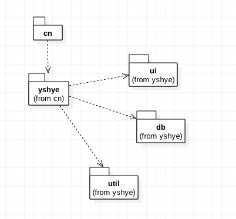
