### 活动图（Activity Diagram）
#### 简介
>活动图是UML用于对系统的动态行为建模的另一种常用工具，它描述活动的顺序，展现从一个活动到另一个活动的控制流。活动图在本质上是一种流程图。活动图着重表现从一个活动到另一个活动的控制流，是内部处理驱动的流程。

#### 活动图的组成元素 Activity Diagram Element
1. 活动状态图（Activity）
>活动状态用于表达状态机中的非原子的运行，其特点如下

  1. 活动状态可以分解成其他子活动或者动作状态。
  2. 活动状态的内部活动可以用另一个活动图来表示。
  3. 和动作状态不同，活动状态可以有入口动作和出口动作，也可以有内部转移。
  4. 动作状态是活动状态的一个特例，如果某个活动状态只包括一个动作，那么它就是一个动作状态。
UML中活动状态和动作状态的图标相同，但是活动状态可以在图标中给出入口动作和出口动作等信息。

2. 动作状态（Actions）
>动作状态是指原子的，不可中断的动作，并在此动作完成后通过完成转换转向另一个状态。动作状态有如下

  1. 动作状态是原子的，它是构造活动图的最小单位。
  2. 动作状态是不可中断的。
  3. 动作状态是瞬时的行为。
  4. 动作状态可以有入转换，入转换既可以是动作流，也可以是对象流。动作状态至少有一条出转换，这条转换以内部的完成为起点，与外部事件无关。
  5. 动作状态与状态图中的状态不同，它不能有入口动作和出口动作，更不能有内部转移。
  6. 在一张活动图中，动作状态允许多处出现。

3. 动作状态约束（Action Constraints）
> 用来约束动作状态。如下图展示了动作状态的前置条件和后置条件 
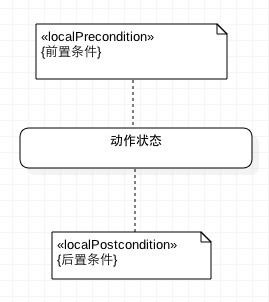

4. 动作流（Control Flow）
>动作之间的转换称之为动作流，活动图的转换用带箭头的直线表示，箭头的方向指向转入的方向。 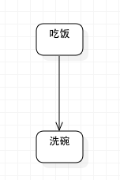

5. 开始节点（Initial Node）
>开始节点：表示成实心黑色圆点 
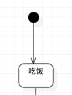

6. 终止节点（Final Node）
>分为活动终止节点（activity final nodes）和流程终止节点（flow final nodes）。

  - 活动终止节点表示整个活动的结束 
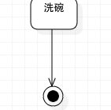
  - 而流程终止节点表示是子流程的结束。 
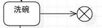
7. 对象（Objects）
8. 数据存储对象（DataStore）
>使用关键字«datastore» 
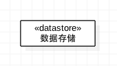

9. 对象流（Object Flows）
>对象流是动作状态或者活动状态与对象之间的依赖关系，表示动作使用对象或动作对对象的影响。用活动图描述某个对象时，可以把涉及到的对象放置在活动图中并用一个依赖将其连接到进行创建、修改和撤销的动作状态或者活动状态上，对象的这种使用方法就构成了对象流。

  对象流中的对象有以下特点：
    1. 一个对象可以由多个动作操作。
    2. 一个动作输出的对象可以作为另一个动作输入的对象。
    3. 在活动图中，同一个对象可以多次出现，它的每一次出现表面该对象正处于对象生存期的不同时间点。

  对象流用带有箭头的虚线表示。如果箭头是从动作状态出发指向对象，则表示动作对对象施加了一定的影响。施加的影响包括创建、修改和撤销等。如果箭头从对象指向动作状态，则表示该动作使用对象流所指向的对象。
  状态图中的对象用矩形表示，矩形内是该对象的名称，名称下的方括号表明对象此时的状态。 

  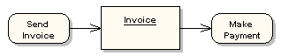

10. 分支与合并（Decision and Merge Nodes）
>分支与合并用菱形表示 
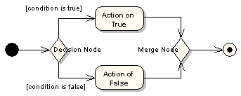

11. 分叉与汇合（Fork and Join Nodes）
>分为水平风向和垂直方向。 

  对象在运行时可能会存在两个或多个并发运行的控制流，为了对并发的控制流建模，UML中引入了分叉与汇合的概念。分叉用于将动作流分为两个或多个并发运行的分支，而汇合则用于同步这些并发分支，以达到共同完成一项事务的目的。

12. 异常处理（Exception Handler）
>当受保护的活动发生异常时，触发异常处理节点。 
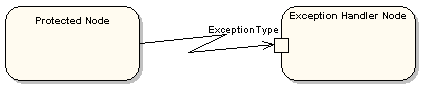

13. 活动中断区域（Interruptible Activity Region）
>活动中断区域围绕一些可被中断的动作状态图。比如下图，正常情况下【Process Order】顺序流转到【Close Order】，订单处理流程完毕；但在【Process Order】过称中，会发送【Cancel Order】请求，这时会流转到【Cancel Order】，从而订单处理流程结束 
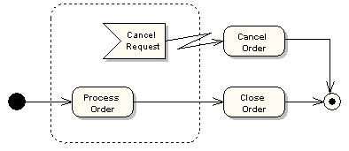

14. 泳道（Partition）
>泳道将活动图中的活动划分为若干组，并把每一组指定给负责这组活动的业务组织，即对象。在活动图中，泳道区分了负责活动的对象，它明确地表示了哪些活动是由哪些对象进行的。在包含泳道的活动图中，每个活动只能明确地属于一个泳道。

  泳道是用垂直实线绘出，垂直线分隔的区域就是泳道。在泳道的上方可以给出泳道的名字或对象的名字，该对象负责泳道内的全部活动。泳道没有顺序，不同泳道中的活动既可以顺序进行也可以并发进行，动作流和对象流允许穿越分隔线。 
  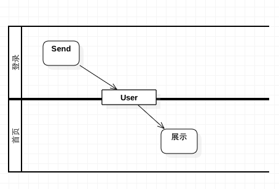

#### 示例【订单系统】
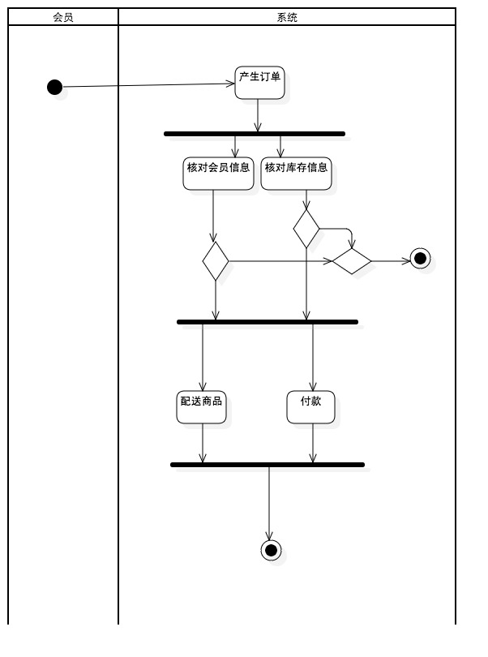
1.  泳道分为：会员泳道和系统泳道。会员选择商品并加入购物车，系统完成订单生成及其支付完毕。
2.  开始节点：会员添加商品到购物车，点击【订单确认】，开始交于系统处理订单流程
3.  结束节点：商品发送完毕和付款成功，订单处理流程结束
4.  活动状态：产生订单、Check Credit Cart核对信用卡、Check Stock 核对库存量、Deliver Goods 发送商品、Process Credit Cart付款
5.  分叉与汇合：【产生订单】份叉为检查库存量和会员支付金额是否足够，如果不足，取消订单，如过库存量和支付金额足够，发送商品和付款，最后汇合为订单完成。

#### 参考日志
[http://www.cnblogs.com/ywqu/archive/2009/12/14/1624082.html](http://www.cnblogs.com/ywqu/archive/2009/12/14/1624082.html)
