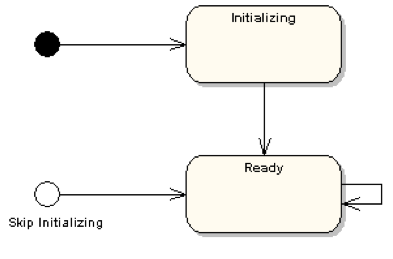
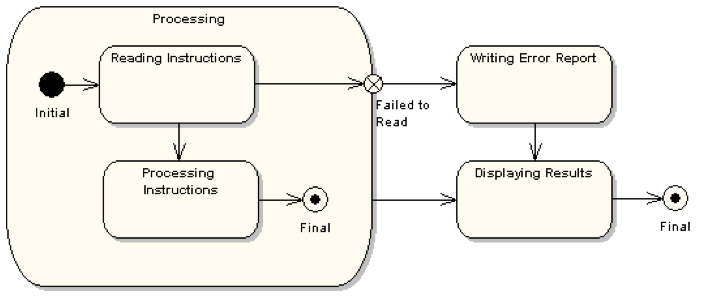
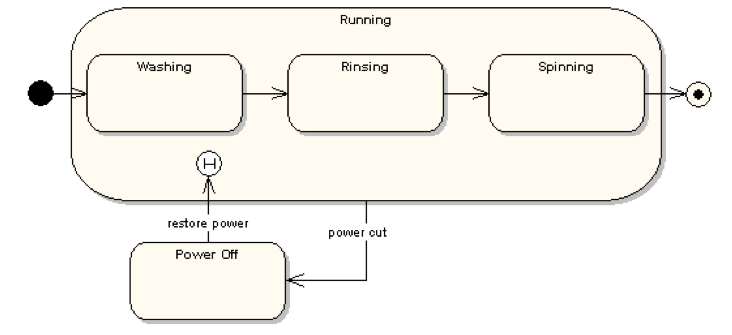
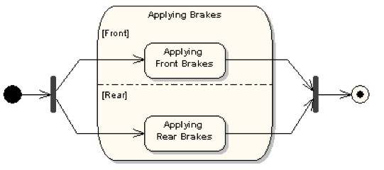
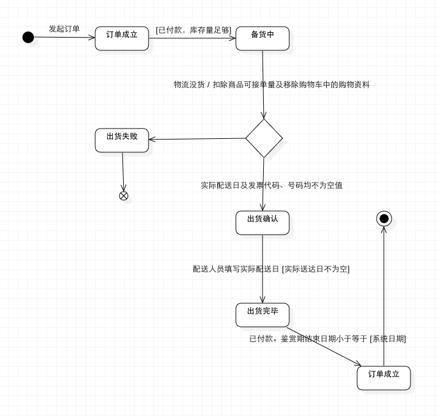

### UML建模之状态图（Statechart Diagram）
#### 简介（Brief introduction）
>状态图（Statechart Diagram）主要用于描述一个对象在其生存期间的动态行为，表现为一个对象所经历的状态序列，引起状态转移的事件（Event），以及因状态转移而伴随的动作（Action）。一般可以用状态机对一个对象的生命周期建模，状态图用于显示状态机（State Machine Diagram），重点在与描述状态图的控制流。

- 状态机
>我们理解为记录下给定时刻状态的机器，根据不同的输入对每个给定的变化而改变其状态或引发一个动作。
在UML中，状态机由对象的各个状态和连接这些状态的转换组成，是展示状态与状态转换的图。
状态图本质上就是一个状态机或是状态机的特殊情况。由表示状态的节点和表示状态之间转换的带箭头的直线组成。

#### 状态图元素（State Diagram Elements）
包括以下内容
- 状态名：区分状态的名称
- 内部活动
- 内部装换
- 入口和出口动作
- 嵌套状态
  - 简单状态：语义上不可分割、对象保持一定属性值，没有子结构
  - 组成状态：
    - 内部嵌套子状态的状体
    - 初始
    - 终止
    - 顺序：多个子状态之间是互斥的、不能同时存在
    - 并发：可能有两个或多个并发的子状态
- 历史状态：伪状态，说明组成状态曾经有的子状态

1. 状态名（States）
> 指在对象的生命周期中的某个条件或者状况，在此期间对象将满足某些条件、执行某些活动活活等待某些事件。所有对象都有状态，状态是对象执行了一系列活动的结果，当某个事件发生后，对象的状态将发生变化。

  - 状态用圆角矩形表示
  - 初态和终态（Initial and Final States）初态用实心圆点表示，终态用圆形内嵌圆点表示。

2. 转移（Transitions）
>是两个状态之间的一种关系，表示对象将在源状态（Source State）中执行一定的动作，并在某个特定事件发生而且某个特定的警界条件满足时进入目标状态（Target State）

  - 事件标记（Trigger）：是转移的诱因，可以是一个信号，事件、条件变化（a change in some condition）和时间表达式。
  - 警界条件（Guard Condition）：当警界条件满足时，事件才会引发转移（Transition）。
  - 结果（Effect）：对象状态转移后的结果。

  包括以下内容
  - 源状态：激活转换之前所处的状态
  - 目标状态：转换完成后对象所处的状态
  - 动作：简短的计算处理过程或一组可执行的语句
  - 监护条件：布尔表达式
  - 事件触发器：引起愿状态的事件

3. 事件/动作（State Actions）
>是一个可执行的原子操作,也就是说动作是不可中断的，其执行时间是可忽略不计的。

  包括以下内容
  - Signal
  - Call
  - Change
  - Time

4. 自身转移（Self-Transitions）
>状态可以有返回自身状态的转移，称之为自身转移（Self-Transitions）

5. 组合状态（Compound States）
>嵌套在另外一个状态中的状态称之为子状态（sub-state）,一个含有子状态的状态被称作组合状态（Compound States）. 如下图，【Check PIN】是组合状态，【Enter PIN】是子状态。

6. 进入节点（Entry Point）
>如下图所示，由于一些原因并不会执行初始化（initialization），而是直接通过一个节点进入状态【Ready】，则此节点称之为进入节点（Entry Point） 

7. 退出节点（Exit Point）
>

8. 历史状态（History States）
>  历史状态是一个伪状态（Pseudostate）,其目的是记住从组合状态中退出时所处的子状态，当再次进入组合状态，可直接进入这个子状态，而不是再次从组合状态的初态开始。 
 
在上图的状态图中，正常的状态顺序是:【Washing】- >【Rinsing】->【Spinning】。 
如果是从状态【Rinsing】突然停电（Power Cut）退出，,洗衣机停止工作进入状态【Power Off】，当电力恢复时直接进入状态【Running】。

9. 并发区域（Concurrent Regions）
>  状态图可以分为区域，而区域又包括退出或者当前执行的子状态。说明组合状态在某一时刻可以同时达到多个子状态。如下图刹车系统，同时进入前刹车【Applying Front Brakes】状态和后刹车【Applying Rear Brakes】状态。 
>

#### 状态图的作用：
1. 清晰描述状态之间的转换顺序，通过转换顺序可以清晰看出事件的执行顺序
2. 清晰的事件顺序有利于程序员在开发程序时避免出现事件错序的情况
3. 清晰地描述了状态转换时所必须触发德尔事件、监护条件和动作等影响转换的因素，有利于程序员汇总非法事件的进入
4. 通过判断更好地描述工作流因为不同的条件发生的分支

#### 状态图练习
 
##### 订单成立状态主要有：
- 订单成立
- 订单取消（Guard:会员订单-缴款期限已过期）
- 备货中（Guard:已付款、订单成立、库存量足够）
- 出货中（Effect:扣除商品可接单量及移除购物车中的购买资料）
- 出货确认（Guard:实际配达日及发票代码、号码均不为空值）
- 出货完毕（Guard:实际配达日不为空）
- 出货失败
- 订单成立（Guard:出货完毕，已付款、鉴赏期结束日期 小于等于 [系统日期]）

##### 分析：
1. 购物车生成订单进入状态【订单成立】
2. 系统检测订单已经付款并且库存量足够，则进入状态【备货中】
3. 物流发货，进入状态【发货中】，状态转移为【发货中】后，需要做的操作有“扣除商品可接单量及移除购物车中的购买资料”
4. 发货完毕后，状态分为【出货确认】和状态【出货失败】，如果状态是【出货失败】，则【结束】，如果状态为【出货确认】，则进入下一步。
5. 配货人员填写实际配达日期，进入状态【出货完毕】。
6. 如果”已付款、鉴赏期结束日期 小于等于 [系统日期]”,则【订单成立】。

##### 参考资料
[http://www.cnblogs.com/ywqu/archive/2009/12/17/1626043.html](http://www.cnblogs.com/ywqu/archive/2009/12/17/1626043.html)
