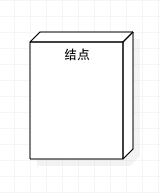
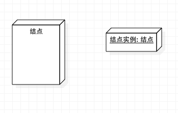

### 部署图（Deployment Diagram)
#### 部署图元素（Deployment Diagram Elements）
> 部署图描述的是系统运行时的结构，展示了硬件的配置及其软件如何部署到网络结构中。一个系统模型只有一个部署图，部署图通常用来帮助理解分布式系统。

#### 部署图元素（Deployment Diagram Elements）
1. 结点（Node）
>  结点是存在与运行时的代表计算机资源的物理元素，可以是硬件也可以是运行其上的软件系统，比如64主机、Windows server 2008操作系统、防火墙等。结点用三维盒装表示，如下图： 

2. 结点实例（Node Instance）
>结点实例名称格式{Node Instance : node}

  与结点的区别在于名称有下划线和结点类型前面有冒号，冒号前面可以有示例名称也可以没有示例名称，如下图 
  

3. 节点类型（Node Stereotypes）
>结点类型有：«cdrom», «cd-rom», «computer», «disk array», «pc», «pc client», «pc server», «secure», «server», «storage», «unix server», «user pc»，并在结点的右上角用不同的图标表示，如下图

4. 物件（Artifact）
>  物件是软件开发过程中的产物，包括过程模型（比如用例图、设计图等等）、源代码、可执行程序、设计文档、测试报告、需求原型、用户手册等等。物件表示如下，带有关键字«artifact»和文档图标

5. 连接（Association）
>结点之间的连线表示系统之间进行交互的通信路径，这个通信路径称为连接（Association），如下图所示，连接中有网络协议。

6. 结点容器（Node as Container）
 >一个结点可以包括其他的结点，比如组件或者物件，则称此结点为结点容器（Node as Container）。如下图所示，结点（Node）包容了物件（Artifact）。

#### 参考文章
[http://www.cnblogs.com/ywqu/archive/2009/12/21/1628545.html](http://www.cnblogs.com/ywqu/archive/2009/12/21/1628545.html)
