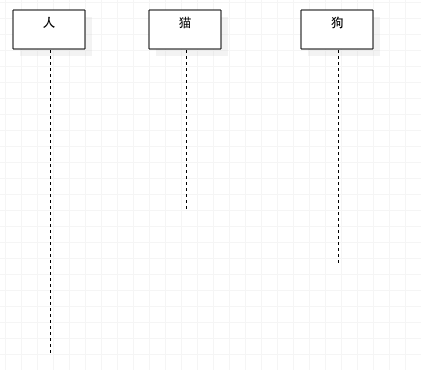
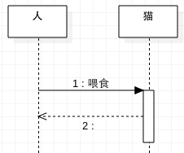
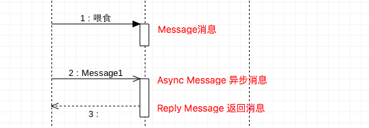
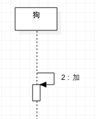

### 时序图（Sequence Diagram）
#### 简介
>时序图（Sequence Diagram）是显示对象之间交互的图，这些对象是按时间顺序排列的。顺序图中显示的是参与交互的对象及其对象之间消息交互的顺序。时序图中包括的建模元素主要有：对象（Actor）、生命线（Lifeline）、控制焦点（Focus of control）、消息（Message）等等。

#### 时序图元素（Sequence Diagram Elements）
- 角色（Actor）
>系统角色，可以是人、及其甚至其他的系统或者子系统。

- 对象（Object）
>对象包括三种命名方式：
  - 第一种方式包括对象名和类名；
  - 第二中方式只显示类名不显示对象名，即表示他是一个匿名对象；
  - 第三种方式只显示对象名不显示类明。

- 生命线（Lifeline）
>生命线在顺序图中表示为从对象图标向下延伸的一条虚线，表示对象存在的时间，如下图 

-  控制焦点（Focus of Control）
>控制焦点是顺序图中表示时间段的符号，在这个时间段内对象将执行相应的操作。用小矩形表示，如下图。 

-  消息（Message）
>消息一般分为
  - 同步消息（Synchronous Message） 
  消息的发送者把控制传递给消息的接收者，然后停止活动，等待消息的接收者放弃或者返回控制。用来表示同步的意义。
  - 异步消息（Asynchronous Message） 
  消息发送者通过消息把信号传递给消息的接收者，然后继续自己的活动，不等待接受者返回消息或者控制。异步消息的接收者和发送者是并发工作的。
  - 返回消息（Return Message） 
  返回消息表示从过程调用返回 

- 自关联消息（Self-Message）
>示方法的自身调用以及一个对象内的一个方法调用另外一个方法。 

#### 时序图的作用
1. 确认和丰富一个使用语境的逻辑表达。
2. 细化用例，将用例表达的需求进一步精细表达。
3. 有效地描述个各类的职责一级各类具有相应的原因。

### 协作图
>在一定的语境中一组对象一级实现某些行为的对象间的相互作用。协作图就是表现对象协作关系的图。

#### 作用
1. 确认和丰富一个使用语境的逻辑表达。
2. 显示对象机器交互关系的空间组织结构
3. 表现一个类操作的实现

#### 协作图的组成
由对象、消息和；链等构成。对象和消息的概念与时序图中的概念相同。主要的特点是链。
- 链：两个或多个对象之间的独立连接，是对象引用元组，是关联的实例。
- 链的表示形式：一个或多个相连的线或弧。

### 时序图和协作图的对比
> 时序图和序列图表示的信息一样，只是方法不同，可通过适当的方式进行转化。

  不同点：
  - 协作图明确了角色的关系，通过协作图角色来限定协作中的对象或链。
  - 协作图不将时间作为单独的维来表示，必须使用顺序号来判断信息的顺序以及并行线程。
  - 序列图和协作图都表示对象间的交互作用，序列图侧重时间顺序，协作图侧重对象间的关系，时间顺序可以从对象流经的顺序编号中获得。
  - 序列图被用于表示方案，而协作图被用于过程的详细设计。
